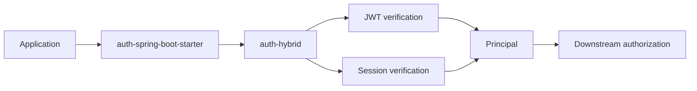

## Auth OSS

[](https://github.com/jho951/auth/actions/workflows/build.yml)
[](https://github.com/jho951/auth/actions/workflows/publish.yml)
[](https://central.sonatype.com/search?q=io.github.jho951)
[](./License)
[](https://github.com/jho951/auth/tags)

이 저장소는 인증(Authentication) 인프라를 제공하는 OSS auth 레이어입니다.

- JWT, 세션, OAuth2 기반 인증 흐름을 모듈별로 분리
- Principal 생성과 전달, token/session 검증을 책임
- roles/scopes/tenantId 같은 인가 메타데이터는 claim/attribute로만 전달
- 최종 authorization 판단은 downstream 서비스가 담당

### 30초 요약

```gradle
repositories {
    mavenCentral()
}

dependencies {
    implementation("io.github.jho951:auth-spring-boot-starter:5.0.0")
}
```

```java
Principal principal = new Principal(user.getId(), user.getRoles());
Tokens tokens = authService.login(principal);
```



현재 릴리스 기준 버전은 `5.0.0`입니다.

## 🚀 목표

- 인증 로직을 애플리케이션 코드에서 분리
- JWT, 세션, OAuth2 기반 인증 흐름을 모듈별로 분리
- 서비스별 사용자 저장소 차이를 SPI로 분리
- 설정 `application.yml`과 스타터 의존성만으로 빠르게 적용

---

## 🧱 프로젝트 구조
``` text
├─ auth-core
├─ auth-common-test
├─ auth-jwt
├─ auth-session
├─ auth-hybrid
├─ auth-spring
├─ auth-spring-boot-starter
├─ samples
│  ├─ sample-jwt-api
│  ├─ sample-session-web
│  └─ sample-hybrid-sso
└─ docs
```
---

## 📚 문서

- 문서 진입점: [docs/README.md](./docs/README.md)
- 아키텍처 개요: [docs/architecture.md](./docs/architecture.md)
- 모듈 가이드: [docs/modules.md](./docs/modules.md)
- 설정 레퍼런스: [docs/configuration.md](./docs/configuration.md)
- API 가이드: [docs/api.md](./docs/api.md)
- 보안 동작: [docs/security.md](./docs/security.md)
- SPI 확장 가이드: [docs/extension-guide.md](./docs/extension-guide.md)
- OAuth2 Starter 설계: [docs/oauth2-design.md](./docs/oauth2-design.md)
- Redis RefreshTokenStore 가이드: [docs/redis-refresh-token-store.md](./docs/redis-refresh-token-store.md)
- 테스트/CI 가이드: [docs/testing-and-ci.md](./docs/testing-and-ci.md)
- 릴리즈 가이드: [docs/release.md](./docs/release.md)
- 트러블슈팅: [docs/troubleshooting.md](./docs/troubleshooting.md)
- RefreshCookieWriter 상세: [docs/refresh-cookie-writer.md](./docs/refresh-cookie-writer.md)

---

## 📦 모듈 (Modules)
> 이 저장소는 **OSS auth** 레이어입니다.

OSS auth는 공통 원리, 확장 포인트, 기본 구현, 프레임워크 연동 책임을 제공합니다.

| Module | 설명 |
| --- | --- |
| `auth-core` | `Principal`, `Tokens`, `User`, `OAuth2UserIdentity`, `AuthException`, `AuthService`, SPI(`UserFinder`, `TokenService`, `RefreshTokenStore`, `PasswordVerifier`, `OAuth2PrincipalResolver`)를 제공합니다. 권한 메타데이터는 claim/attribute로만 전달합니다. |
| `auth-common-test` | 테스트 픽스처(`AuthTestFixtures`)와 샘플/통합 테스트용 `InMemoryRefreshTokenStore`를 담는 테스트 전용 모듈입니다. |
| `auth-jwt` | JWT 토큰 발급/검증 구현(`JwtTokenService`)을 제공합니다. |
| `auth-session` | 세션 저장소/매퍼/추출기/필터 추상과 기본 구현(`SessionService`, `SimpleSessionStore`, `SessionAuthenticationFilter`)을 제공합니다. |
| `auth-hybrid` | JWT와 세션을 조합하는 `HybridAuthenticationProvider` 계층과 기본 조합 구현을 제공합니다. |
| `auth-spring` | `AuthProperties`처럼 Spring 연동에 필요한 공통 설정 바인딩을 제공합니다. |
| `auth-spring-boot-starter` | JWT, 세션, hybrid, OAuth2 연동용 자동 구성(`AuthAutoConfiguration`, `AuthSecurityAutoConfiguration`, `AuthSessionAutoConfiguration`, `AuthHybridAutoConfiguration`, `AuthHybridCookieAutoConfiguration`, `AuthOAuth2AutoConfiguration`)과 기본 브리지를 제공합니다. |
| `samples/*` | `sample-jwt-api`, `sample-session-web`, `sample-hybrid-sso`의 데모 앱 |
| `docs` | 문서 소스와 멀티 모듈 안내 |

## 🧪 샘플 앱

- `sample-jwt-api`: JWT + refresh cookie의 최소 연결 예시
- `sample-session-web`: 세션 인증의 최소 연결 예시
- `sample-hybrid-sso`: OAuth2 연동을 켤 수 있는 최소 hybrid 예시

`sample-hybrid-sso`는 기본 설정에서 OAuth2 로그인을 비활성화합니다. 실제 Provider 설정을 넣을 때만 `auth.oauth2.enabled=true`와 `spring.security.oauth2.client.*`를 함께 구성하세요.

샘플별 실행 방법은 [docs/samples.md](./docs/samples.md)를 참고하세요.

---

## 🚀 시작하기

### 1️⃣ Maven Central 사용

```gradle
repositories {
    mavenCentral()
}

dependencies {
    implementation("io.github.jho951:auth-core:5.0.0")
    implementation("io.github.jho951:auth-spring-boot-starter:5.0.0")
}
```

### 2️⃣ 스타터 선택

- `auth-spring-boot-starter` 하나만 추가하면 JWT, 세션, hybrid, OAuth2 연동용 자동 구성이 함께 제공됩니다.
- 필요한 경우 `auth-core`, `auth-jwt`, `auth-session`, `auth-hybrid`, `auth-spring`의 개별 구현체나 SPI를 추가로 조립하면 됩니다.
- 서비스별 정책은 애플리케이션이 구현해야 하며, 이 저장소는 인증 기술 부품과 범용 starter까지만 책임집니다.
---

### 3️⃣ 공통 유틸 사용
> `Strings` 같은 유틸리티는 `auth-core`에 있습니다.

```java
import com.auth.common.utils.Strings;

if (Strings.isBlank(username)) throw new IllegalArgumentException("username must not be blank");

String userId = Strings.requireNonBlank(rawUserId, "userId");
TokenService tokenService = Strings.requireNonNull(customTokenService, "tokenService");
```

---

### 4️⃣ application.yml 설정
- `auth-spring-boot-starter`가 `auth.jwt.secret`을 감지하면 기본 `TokenService`, `RefreshTokenExtractor`, `BCryptPasswordVerifier`, `RefreshTokenStore`(기본은 `auth-common-test`의 in-memory 구현) 등을 자동 등록합니다. 쿠키 기반 refresh, 세션 인증, OAuth2 성공 후 처리도 같은 starter 안에서 연결할 수 있습니다.

```yml
auth:
  refresh-cookie-name: "ADMIN_REFRESH_TOKEN"

  jwt:
    secret: ${AUTH_JWT_SECRET}
    access-seconds: 3600
    refresh-seconds: 1209600
```

`auth.jwt.refresh-seconds`는 다음 3곳에 동일하게 적용됩니다.
- Refresh JWT 만료 시간
- 서버 저장소의 Refresh Token TTL (`expiresAt`)
- Refresh 쿠키 `Max-Age`

### 5️⃣ UserFinder 구현 (필수)
> 각 서비스마다 사용자 저장 방식이 다르기 때문에 UserFinder는 반드시 애플리케이션에서 구현해야 합니다.
```java
// 예시
@Component
public class AdminUserFinder implements UserFinder {

	private final UserRepository userRepository;

	public AdminUserFinder(UserRepository userRepository) {
		this.userRepository = userRepository;
	}

	@Override
	public Optional<User> findByUsername(String username) {
		return userRepository.findByUsername(username)
			.map(e -> new User(
				String.valueOf(e.getId()),
				e.getUsername(),
				e.getPassword(),
				e.getRoles()
			));
	}
}
```

`auth-spring-boot-starter`는 구성 계층이고, JWT 기반 `TokenService` 구현은 `auth-jwt`에서 제공합니다.
운영 환경에서 중앙 Redis를 사용한다면, `RefreshTokenStore` 구현은 인증 서버 애플리케이션이 직접 제공하는 것을 권장합니다.

### 6️⃣ 애플리케이션에서 API 구성
- 이 모듈은 기본 로그인/재발급/로그아웃 컨트롤러를 제공하지 않습니다.
- 서비스 애플리케이션이 `AuthService`, `RefreshTokenExtractor`, `RefreshCookieWriter`로 API를 구성합니다.

### 7️⃣ OAuth2/OIDC와 함께 사용
> Google/GitHub/Kakao 같은 Provider 설정은 각 서비스 애플리케이션에서 처리하고, 인증이 끝난 내부 사용자에게 이 모듈이 JWT를 발급하도록 연결합니다.

```java
Principal principal = new Principal(user.getId(), user.getRoles());
Tokens tokens = authService.login(principal);
```

> `Principal`이 노출하는 `getAuthorities()`/`getAttributes()`는 권한 선택지에 대한 메타데이터일 뿐이며, 실제 `roles`/`scopes` 판단은 downstream 구성(예: Spring Security의 `GrantedAuthority`)에서 처리해야 합니다.

`auth-spring-boot-starter`는 `spring-boot-starter-oauth2-client`와 함께 사용하며 `OAuth2PrincipalResolver`를 제공하면,
OAuth2 로그인 성공 후 `{"accessToken":"..."}` JSON 응답과 refresh cookie 작성까지 자동 처리합니다.

### 8️⃣ 순수 Java 사용
> 이 모듈은 Spring Boot 없이도 사용할 수 있습니다.

```java
TokenService tokenService = new JwtTokenService(secret, 3600, 1209600);
RefreshTokenStore refreshTokenStore = new InMemoryRefreshTokenStore();
PasswordVerifier passwordVerifier = new BCryptPasswordVerifier();

AuthService authService = new AuthService(
    userFinder,
    passwordVerifier,
    tokenService,
    refreshTokenStore,
    Duration.ofDays(14)
);
```


## 🔐 GitHub Actions Environment
> 배포(`publish`) 시에만 Central Portal 인증/서명 정보가 필요합니다.

- `MAVEN_CENTRAL_USERNAME` - Central Portal user token username
- `MAVEN_CENTRAL_PASSWORD` - Central Portal user token password
- `MAVEN_CENTRAL_GPG_PRIVATE_KEY`
- `MAVEN_CENTRAL_GPG_PASSPHRASE`
- `MAVEN_CENTRAL_NAMESPACE` (예: `io.github.jho951`, 자동 publish 시 필요)

---

## 🛠 Build & Test
>프로젝트 빌드 및 테스트는 다음 명령어로 실행할 수 있습니다.

```bash
./gradlew clean build
```
---

### 🔐 Security Integration
> `AuthOncePerRequestFilter`가 자동으로 빈으로 등록됩니다.

```java
@Bean
SecurityFilterChain filterChain(HttpSecurity http,
		AuthOncePerRequestFilter authFilter) throws Exception {
	return http
		.csrf(csrf -> csrf.disable())
		.authorizeHttpRequests(auth -> auth
			.requestMatchers("/login", "/refresh", "/logout").permitAll()
			.anyRequest().authenticated()
		)
		.addFilterBefore(authFilter, UsernamePasswordAuthenticationFilter.class)
		.build();
}
```

## 🏷 Release Policy
> 릴리즈는 명확한 책임 분리를 원칙으로 합니다.

* 버전은 루트 `build.gradle`의 `version`에서 관리합니다.
* 태그(`v5.0.0`)는 직접 생성합니다. ***(현재 `v5.0.0`)***
* CI는 태그가 `push` 될 때 `publish`를 수행하고, Central Portal에 자동 게시합니다.

### 릴리즈 절차
```bash
git add -A
git commit -m "release: v5.0.0"
git tag -a v5.0.0 -m "release: v5.0.0"
git push origin main
git push origin v5.0.0
```

## 📄 License
> [Apache License 2.0](./License)
